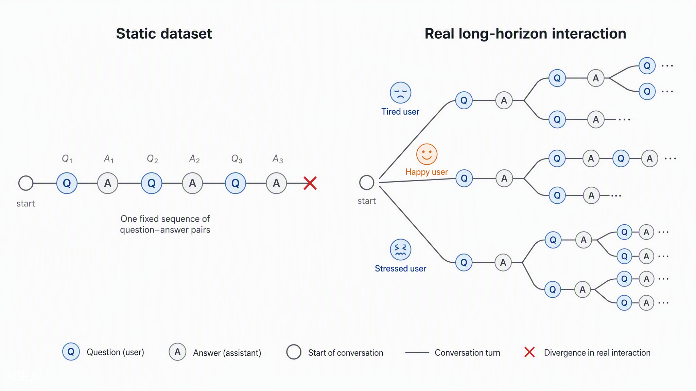
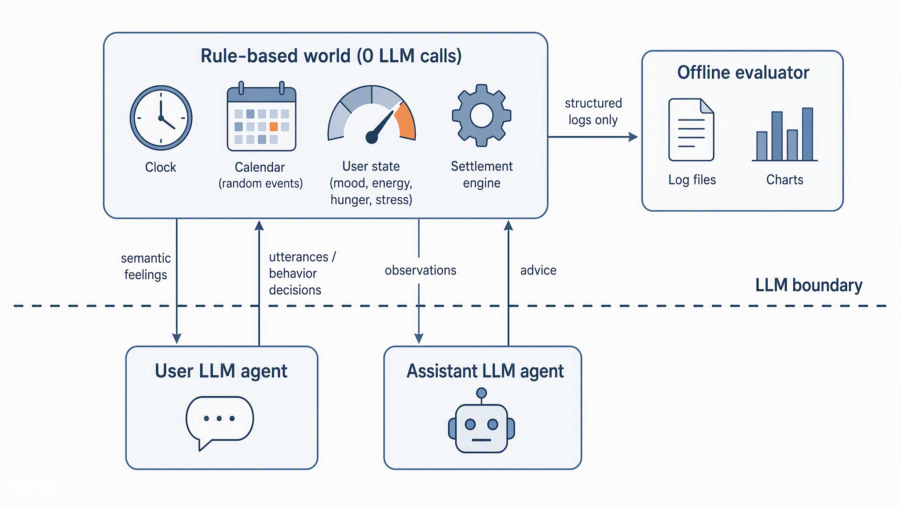

# UserSim：以闭环稳态控制评测长程用户–助手交互的可复现 Benchmark

> 论文全文工作稿 v6（§3 统一 POMDP 形式化；Introduction 去形式化；两张插图由绘图模型生成；术语向业界标准概念对齐；全文去 AI 协作腔）。
> 数值占位约定：`[·]` 待跑分填充；引用占位 `[n]` 对应文末参考文献清单。
> 与实现的一致性以 `ARCHITECTURE.md` 与 `docs/00–16` 为准。

---

## Abstract

LLM 驱动的个人助手正从一次性问答工具转变为长期伴随式智能体，但主流评测体系仍停留在短 horizon 范式，无法回答"一个模型能否在长达一个月的持续交互中始终理解并照顾好它的用户"。本文提出 **UserSim**，一个长程用户–助手模拟与评测系统。我们把"助手协助用户维持良好状态"形式化为**带稳态调节代价的部分可观测马尔可夫决策过程（POMDP），即一个闭环稳态控制问题**：纯规则世界持续产生扰动，将用户的四维内部状态推离设定带（setpoint band）；助手的建议经用户响应核间接转化为恢复行为，助手相当于控制器，用户是带人格的执行机构；评测是对该 POMDP 滚动轨迹的oracle 读出。系统由一条边界约束：**世界 0 次 LLM 调用，LLM 只存在于用户与助手两个 agent 内**；评估器只消费结构化日志，从不读对话文本，全部指标是轨迹的确定性函数，可离线重放、完全可复现。我们把评测器自身的效度当作一等设计问题：以 5 项规则指标构成用户模拟质量门，以 live 锚点校验（anchor-based sanity check）断言判别力，以多 seed 置信区间与最小可检测效应报告一切跨模型结论。在 [N] 个主流模型与 [M] 种 agent 架构的横评中，UserSim 稳定区分了模型与架构的长程能力差异（锚点对分离度 Cohen's $d$ = [·]，主榜相邻名次对中分差超过 MDE 的比例 [·]%），并揭示了短程榜单成绩与长程表现之间的[弱/中/强]相关性（Spearman $\rho$ = [·]）。全部种子、配置哈希、prompt 版本与轨迹日志公开，任何第三方可用自己的密钥一键复算榜单。

---

## 1 Introduction

LLM 驱动的个人助手正在从"一次性问答工具"转变为"长期伴随式智能体"：它需要在数周乃至数月的跨度里记住用户、理解用户、在恰当的时机介入、在不该打扰时保持安静。主流评测体系仍停留在短 horizon 范式：静态问答集测知识，单 episode 任务 benchmark 测工具调用与任务完成率。这些范式都无法回答产品决策者真正关心的问题：**这个模型（或这套 agent 架构）能不能在长达一个月的持续交互中始终"懂"它的用户？** 长程能力的瓶颈已经转移到评测侧，我们缺少一把能度量它的尺子。

现有评测范式在长程场景下沿三条路径结构性失效。**其一，静态数据集。** 真实对话是树状的：不同人格的用户对同一句话给出不同回应，轨迹在每一轮都可能分叉；数据集是一条预设的线，轮次加长后实际轨迹必然偏离脚本，评测随之失效（图 1）。**其二，交互式任务 benchmark**（τ-bench 一类，以及 AgentBench、SWE-bench 等多步任务评测）。它们把评测从"判答案"推进到"跑 episode"，但 episode 以单任务完成为边界，终局信号是稀疏的 0/1：测得了"这一次任务成没成"，测不了"一个月里用户状态被维护得好不好"；失败发生时，错在第 3 天的错误记忆还是第 20 天的过度打扰，无从归因。**其三，LLM-as-judge。** 让模型对对话文本打分，牺牲了评测的可复现性：judge 自身在漂移，文风与实质被混为一谈，同一条轨迹换个 judge 版本结论就变。用户模拟器方向（从早期的议程式模拟到近期 LLM 驱动的 simulated user）提高了交互的自然度，但大多服务于单轮偏好预测或对话采样，缺少独立于 LLM 的用户状态真值。没有真值，模拟再逼真也无法构成测量。

*图 1：静态数据集与真实长程交互的对比。左：静态数据集是一条预设路径，轮次增加后实际轨迹必然偏离脚本；右：真实交互是不断分岔的决策树，用户的人格与状态决定走向哪条分支。*

本文的关键主张是：**不要读对话，去模拟用户；不要评判文本，去测量轨迹。** 我们把"助手协助用户维持良好状态"建模为一个闭环控制问题（统一形式化见 §3）：一个纯规则的世界按日程与随机事件持续扰动用户的内部状态（心情、精力、饱腹、压力），把它推离"设定带"；助手无法直接改变状态，只能通过建议影响用户执行恢复行为的时机与质量。在这个设定里，助手相当于控制器，用户是带人格的执行机构。模糊的"用户满意度"由此转译成一组可计算的控制性能量：稳态误差、调节时间、超调量、带内驻留比、收敛判定。稀疏的终局信号被逐时段的稠密状态轨迹取代，失败归因从"猜"变成"查"，每次失控都能定位到具体的维度、时段与事件。

基于这一建模，我们实现了 **UserSim**，一个长程用户–助手模拟与 benchmark 系统。全部设计由一条边界约束：**世界 0 次 LLM 调用，LLM 只存在于两个 agent 内**。用户状态的唯一写入方是规则结算器，用户 agent 只负责把状态"表达"为言行（**状态–表达解耦**）：agent 看到的是语义化感受，永远接触不到状态数值，也就无法"报数"或篡改真值。助手 agent 每轮必须输出对用户状态与人格的结构化估计，"理解用户"从隐含能力变为强制观测项，估计误差的学习曲线与人格画像识别精度直接计分。评估器只消费结构化日志，从不读对话文本，全部指标是轨迹的确定性函数，可离线重放、完全可复现。世界由种子确定性生成并可无限延展；被测件经统一 agent 接口接入（HTTP 长轮询协议，外部 agent 装载技能即可参测），模型与 agent 架构在 E1/E2/E3 评测矩阵下分离评测。每次 run 落盘 artifact 哈希、prompt 版本与 provider 实际应答模型作为复现凭证；协议违约与控制失败是两类独立的失败模式。

我们把**评测器自身的效度**当作一等设计问题，而非事后补实验。评估按被测对象分三层：Layer 1 检查世界仿真自身的动力学健康度；Layer 2 是用户模拟器的质量门，5 项规则指标（M1–M5）不过门，则基于该轨迹的助手分数不可信；Layer 3 才是助手的控制与观测指标。benchmark 的判别力由 live 锚点对（参考实现 vs 失效基线）的校验断言保证（Cohen's $d > 1.5$，否则榜单无效）；跨模型结论一律以多 seed 均值 ± 95% CI 与最小可检测效应（MDE）报告，杜绝"差 0.5 分排第 3"的伪排名。

我们围绕三个研究问题展开：**(RQ1)** UserSim 能否稳定地区分助手能力的高低（量程与判别力）？**(RQ2)** 固定 harness 横评模型（E1）、固定模型横评 harness 与外部 agent（E2/E3）时，排名结论分别是什么、彼此是否一致？**(RQ3)** 用户模拟器的人格一致性与行为拟真度如何：它作为评测器是否可信，评测结论对用户模型的选择是否稳健？

**贡献**：

1. **形式化**：将 user–assistant 长程交互统一建模为带稳态调节代价的 POMDP，给出世界扰动、用户状态、间接驱动与信念估计的完整刻画与轨迹指标体系，把长程评测从文本评判转为轨迹测量（§3）；
2. **系统**：UserSim benchmark，包含种子确定性世界、状态–表达解耦、强制结构化用户估计、0-LLM 规则评估器、统一 agent 接入接口与完整可复现性凭证（§4）；
3. **效度方法论**：评测器效度的分层评估框架（用户一致性质量门 M1–M5、锚点校验锚点对、MDE 统计报告、规则评分 vs 人类 vs LLM judge 的三方对比协议）（§4.4、§4.5、§5.5）；
4. **实证**：基于 E1/E2/E3 评测矩阵对 [N] 个模型与 [M] 种 harness 的多 seed 横评，以及判别力、效度、归因、鲁棒性四组支撑实验（§5）。

就我们所知，UserSim 是首个以闭环控制形式化 user–assistant 长程交互、并以零 LLM 规则评估器给出完全可复现轨迹指标的 benchmark 系统。

---

## 2 Related Work

### 2.1 静态数据集评测：预设路径假设的失效

以 MT-Bench [1]、AlpacaEval [2] 为代表的静态基准通过预设问答对评估模型能力；Chatbot Arena / LMArena [3] 以众包对战的 Elo 评分扩展了覆盖面，Arena-Hard [4] 进一步筛选高难度提示。这类方法本质上是"开卷考试"：对话路径固定，且假设存在可比较的参考答案或偏好序。长程交互中同一目标可由多种策略达成，单一参考会系统性低估有效策略空间；更根本的是，真实对话是树状分岔的：用户的下一轮回应取决于其人格与当前状态，静态数据集无法表达这种条件依赖。随着公开榜单被训练数据污染 [5]，静态题面的区分力还在持续衰减。UserSim 以种子化的生成式世界取代固定题面：同一被测件面对无限延展的确定性扰动流，对数据污染与榜单过拟合具有天然鲁棒性。

### 2.2 交互式任务 Benchmark：从判答案到跑 episode，但信号仍然稀疏

AgentBench [6]、WebArena [7]、OSWorld [8]、SWE-bench [9]、GAIA [10] 等将评测推进到真实环境交互；τ-bench [11] 与 τ²-bench [12] 进一步引入 LLM 模拟用户，在航空/零售/电信域测试 agent 在用户协作下的任务完成率，是与本文最接近的工作。这一范式的共同特征是**episode 以单任务完成为边界、终局信号为稀疏 0/1**：它们测"这次任务成没成"，不测"一个月里用户状态被维护得好不好"；任务边界清晰、目标外生给定，无法刻画开放域伴随场景中目标漂移、偏好涌现与干预时机等长程现象；稀疏终局信号也让 credit assignment 无从下手。另一类工作评测长程记忆本身：LongMemEval [13]、LoCoMo [14] 用长对话历史考察记忆检索与更新，但其评测仍是对预设问题的短程问答，记忆未被放入"记忆→行为→后果→再记忆"的闭环中检验。UserSim 把终局信号替换为逐时段的稠密状态真值轨迹：失败可归因到具体维度、时段与事件。

### 2.3 用户模拟：从议程式到生成式，真值缺位是共同瓶颈

用户模拟有悠久传统：议程式（agenda-based）模拟器 [15] 与 n-gram/检索式 persona（PersonaChat [16]）服务于任务型对话的策略训练；LLM 时代，Generative Agents [17] 展示了 believable 的拟人行为，SOTOPIA [18] 构建了社会交互的模拟与评测环境，一批工作用 LLM 模拟用户做对话采样、偏好预测与 judge 增强 [19]。共同瓶颈是：**用户"内心"没有独立于 LLM 的真值**。用户的状态、动机与满足感只存在于生成它的那个 LLM 的隐含表征里，评测者无从知道用户"真的"变好了还是只是台词变积极了；对模拟质量的检验多依赖人工抽查或下一个 LLM 的判断，效度论证因此循环。UserSim 的关键区别在于状态–表达解耦：用户状态由规则动力学唯一写入，LLM 只负责表达；真值独立于任何 LLM，模拟质量本身由 0-LLM 规则指标（M1–M5）门控。

### 2.4 LLM-as-judge：便利性与效度争议

LLM-as-judge 已成为事实上的开放域评测标准 [1,2,20]，但其效度争议持续积累：位置偏置与冗长偏置 [1]、自我偏好 [21]、文风与实质混淆 [22]、judge 模型版本漂移导致的不可复现 [23]。G-Eval [20] 一类方法以思维链缓解但无法根除，因为 judge 本身是被评技术的同族产物。过程奖励模型（PRM）[24] 把评估粒度推进到步骤级，但需要大规模细粒度人工标注，且其单向奖励分解假设难以处理"用户状态变化既是助手行为的结果、又是下一轮交互前提"的双向耦合。UserSim 的做法更为彻底：**评估器 0 次 LLM 调用、从不读对话文本**，全部指标是结构化日志的确定性函数。规则评分无需"更懂对话"，因为评测的锚点应当是可观测的状态真值而非文本表象。§5.5 给出与人类排序、LLM judge 的三方对比证据。

### 2.5 定位对照

| 维度 | 静态数据集 | 交互式任务 Bench | 用户模拟/社会沙盒 | LLM-as-judge | **UserSim** |
|---|---|---|---|---|---|
| 交互分岔 | ✗ | 部分 | ✓ | ✗ | ✓ |
| 长程（周/月级） | ✗ | ✗ | 部分 | ✗ | ✓ |
| 独立状态真值 | ✗ | 部分（任务态） | ✗ | ✗ | ✓（规则动力学） |
| 稠密可归因信号 | ✗ | ✗ | ✗ | ✗ | ✓ |
| 评估器 0 LLM | ✓ | ✓ | ✗ | ✗ | ✓ |
| 完全可复现 | ✓ | 部分 | ✗ | ✗ | ✓（种子+哈希凭证） |
| 区分模型 vs 架构 | ✗ | ✗ | ✗ | ✗ | ✓（E1/E2/E3） |

控制论与形式化方面，本文借用稳态（homeostasis）与闭环反馈的经典概念 [25,26]、部分可观测随机控制/POMDP 的观测器视角 [27] 与时序抽象的 options 框架 [28]，但不追求控制理论的完备性。在本文中，这些来源是同一对象的不同侧面：**交互是 POMDP，目标是稳态调节，指标是滚动轨迹上的控制泛函**（§3）。

---

## 3 统一形式化：带稳态调节代价的用户–助手 POMDP

本节给出全文唯一的形式化对象。我们将用户–助手长程交互建模为一个**双时间尺度的部分可观测马尔可夫决策过程（POMDP）**，其代价函数由稳态调节（homeostatic regulation）目标塑造。由此，POMDP 的状态、信念与部分可观测性，与控制论的设定点、扰动、超调与稳态误差，在同一个数学对象中各就其位：**助手的问题是部分可观测、间接驱动条件下的随机控制；benchmark 的评分则是对该 POMDP 滚动（rollout）的oracle 读出**。

### 3.1 决策问题的定义

**定义 3.1（用户–助手 POMDP）。** 一个 episode 含有限时域 $T$ 个决策时刻（外层时钟 slot；默认每天 4 个、30 天共 120 个），交互由六元组 $(\mathcal{S}, \mathcal{A}, \Omega, \mathcal{T}, O, c)$ 定义：

- **隐状态** $s_t = (\mathbf{x}_t, p, \mathbf{n}_t, h_t, w_t, q_t, m_t) \in \mathcal{S}$：$\mathbf{x}_t \in [0,1]^4$ 为用户感受状态（心情、精力、饱腹、压力）；$p$ 为冻结人格（大五 30 细分面 + 结构化喜好，episode 内不变）；$\mathbf{n}_t \in [0,1]^4$ 为需求向量；$h_t$ 为习惯化记忆（各恢复动作的最近执行时刻）；$w_t$ 为环境上下文（天气、日历）；$q_t$ 为日程与活跃事件；$m_t$ 为资金。slot 粒度的马尔可夫性由构造保证：一切影响未来的历史依赖（习惯化、需求、系列事件进度）都被显式纳入 $s_t$。
- **动作** $a_t \in \mathcal{A}$：助手在时刻 $t$ 的行为是一个**宏动作**（一次 session），即在内层时钟 $k = 1, \dots, K_t$ 上展开的多轮对话；每轮输出回复、工具调用与结构化估计 $\hat{\mathbf{x}}$（见 §3.3）。无 session 时 $a_t = \varnothing$。该嵌套对应 options 框架 [28]，外层决策与评测只依赖宏动作的结算结果。
- **观测** $o_t \in \Omega$：助手可见信息的封闭集，包括对话历史、工具结果、余额、日程提示、恢复动作目录与时段信息。观测通道 $O$ 是对 $s_t$ 与交互历史的确定性读出，**不含 $\mathbf{x}_t$ 的数值**。
- **转移** $\mathcal{T}(s_{t+1} \mid s_t, a_t)$：由规则动力学唯一确定（§3.2），含外生扰动过程的随机性；不调用任何 LLM。
- **代价** $c(s_t) = e(\mathbf{x}_t)$：由稳态调节目标塑造。设设定点 $\mathbf{x}^*$ 与设定带半宽 $\beta$，逐维**单侧误差**只惩罚"不够好"的方向（过度开心不算失控；压力为反向维度，只罚超标）：

$$e_d(\mathbf{x}) = \begin{cases} \max(0, x_d - x_d^*), & d = \sigma \\ \max(0, x_d^* - x_d), & \text{otherwise} \end{cases}, \qquad c(s) = e(\mathbf{x}) = \tfrac{1}{4}\textstyle\sum_d e_d(\mathbf{x})$$

$\mathbf{x}$ 处于设定带内 $\iff \forall d: e_d \le \beta$。

**优化目标。** 助手策略 $\pi: (o_{\le t}, a_{<t}) \mapsto a_t$ 最小化有限时域期望总代价

$$J_T(\pi) = \mathbb{E}_{\pi}\Big[\textstyle\sum_{t=1}^{T} c(s_t)\Big]$$

我们取无折扣（$\gamma = 1$）：与 episode 级评测口径一致，并避免折扣因子成为额外的主观超参；需要强调晚期表现时，以时间加权变体（对应 ITAE，见 §3.4）报告。

### 3.2 转移结构：扰动、规则动力学与用户响应核

转移核分解为三个因子：

$$\mathcal{T}(s_{t+1} \mid s_t, a_t) = \sum_{\mathbf{u}_t,\, d_t}\; P_{\mathrm{env}}(s_{t+1} \mid s_t, \mathbf{u}_t, d_t) \cdot P_{\mathrm{sched}}(d_t \mid s_t) \cdot \kappa(\mathbf{u}_t \mid s_t, a_t)$$

- **外生扰动** $d_t \sim P_{\mathrm{sched}}$：日程模板事件（工作、通勤、三餐、睡眠等强制性消耗）⊕ 泊松到达的随机事件（加班、应酬、天气突变、临时邀约）⊕ 多日系列事件（出差、备考、旅行）；扰动既有瞬时效果也有跨日后效。
- **规则动力学** $P_{\mathrm{env}}$：$\mathbf{x}_{t+1} = \mathrm{clip}\big(A\,\mathbf{x}_t + B\,\mathbf{u}_t + D\,d_t + \varepsilon\big)$，其中 $A$ 含自然漂移（饥饿随时间增长、精力经睡眠恢复），$\varepsilon$ 为种子化噪声；动力学叠加习惯化（恢复效果 $\times w(\Delta t)$，逐动作参数化的恢复曲线）、需求动力学（饥饿/社交/刺激/成就各自非单调的驱动力曲线）、峰终定律与消极偏向、人格调制等拟人化机制（实现细节见 §4.1.3）。
- **用户响应核** $\kappa(\mathbf{u}_t \mid s_t, a_t)$：助手的动作（建议、安排、说服）**不直接进入动力学**，而是经用户 agent 的随机响应转化为实际执行的恢复行为 $\mathbf{u}_t$。$\kappa$ 是"间接驱动"的数学表达：助手是控制器，用户是带人格的执行机构。用户可能拒绝违背人格 $p$ 的安排，是否求助、何时开口也由 $\kappa$ 决定并被计分。机制上，助手的工具调用（如新增恢复日程）经世界裁决落地为事件，其效果在 slot 结算时进入 $\mathbf{u}_t$ 或 $d_t$。**对话与状态之间唯一的桥是世界的规则裁决**，助手无法通过言辞直接改变用户状态。

**注记 3.1（与经典 POMDP 的两点差异）。** 其一，代价定义在隐状态上，助手在交互中永远观测不到 $c(s_t)$ 的即时数值。它在交互中没有对应的即时奖励信号，只是评测者侧的oracle 读出。其二，响应核 $\kappa$ 由一个 LLM agent 实现，比经典转移核更"厚"，但被公理 A0–A1 约束在表达层：$\kappa$ 不改变 $s$ 的数值，只决定表达与 $\mathbf{u}$ 的选择。$\kappa$ 对人格 $p$ 的保真度本身是被门控的对象（Layer 2，M1–M5，§4.4）。

### 3.3 信念、强制观测与估计质量

部分可观测条件下，决策的充分统计量是信念状态 $b_t$。UserSim 不规定助手实现何种滤波器，但**契约强制**其每轮输出点估计 $\hat{\mathbf{x}}_t$ 与人格画像 $\hat{p}_t$（公理 A2）。由此定义观测器族评测量：

- **状态估计误差** $\varepsilon_{\mathrm{obs}}(t) = \|\mathbf{x}_t - \hat{\mathbf{x}}_t\|_2$，其终值与学习曲线度量滤波质量；
- **画像精度**：$\hat{p}$ 与真实 $p$ 的逐项匹配（30 细分面 + 11 偏好类目），度量长程用户建模能力。

**注记 3.2（自报信念的诚实性）。** $\hat{\mathbf{x}}$ 由被测件自报，存在投机空间（如惰性复制先验均值）。约束来自三处：画像精度核对冻结维度；基于错误估计的建议将推高控制代价，使投机在控制族指标上间接受罚；惰性策略下 $\varepsilon_{\mathrm{obs}}$ 学习曲线不下降，在观测族指标上直接失分。残余风险讨论见 §6。

### 3.4 从滚动到指标：评测作为轨迹泛函

benchmark 的评分是对滚动 $(s_{1:T},\, a_{1:T},\, o_{1:T},\, \hat{\mathbf{x}}_{1:T})$ 的确定性泛函，全部离线计算、0 次 LLM 调用。稳态控制语汇中的每个概念都对应一个轨迹泛函 [29]：

| 泛函 | 定义 | 控制论语义 |
|---|---|---|
| 稳态误差 $e_{ss}$ | $e(\mathbf{x}_T)$（窗口末端） | 是否收敛到设定带 |
| 调节时间 $t_s$ | 扰动后进入带内（$\max_d e_d \le \beta$）并保持的时延 | 回稳速度 |
| 上升时间 $t_r$ | 首次恢复到带内的时延 | 响应速度 |
| 超调量 $M_p$ | 恢复过程中反向越带的最大幅度 | 过度补偿 |
| IAE / ISE / ITAE | $\sum_t c_t$、$\sum_t c_t^2$、$\sum_t t\cdot c_t$ | 全程/大误差/晚期误差加权 |
| 带内驻留比 | $\frac{1}{T}\sum_t \mathbb{1}\{\max_d e_d(\mathbf{x}_t) \le \beta\}$ | 稳态占据 |
| 平稳性 | 状态方差 $\sigma^2$、振荡计数 | 长窗波动 |
| 判定 verdict | 末端趋势 + 驻留比 → converged / oscillating / diverged | 稳定性分类 |
| 观测器族 | $\varepsilon_{\mathrm{obs}}$ 学习曲线、画像精度 | 滤波质量 |
| 行为族 | 求助时延、打扰率 | 介入时机 |
| 契约族 | 违约率（每百回合） | 协议可靠性 |

换言之，**代价轨迹 $c(1{:}T)$ 本身就是完整的过程记录**：稀疏 0/1 终局信号被替换为逐时刻稠密读出，credit assignment 从推断变为检索：一次失败可被定位到"第 12 天下午、压力维、加班扰动后未建议恢复"的具体时空坐标。主 KPI（benchmark_score）为上述泛函的加权聚合，权重外置并计入 artifact 哈希（§4.4）。

**注记 3.3（该形式化换来的三个评测性质，以及一条适用边界声明）。** (i) **稠密可归因**：见上；(ii) **文本无关**：泛函不读取对话语义，评估结论对措辞、文风与语言不敏感，也无法被"把话说漂亮"刷分；(iii) **可复现**：$\mathbf{x}$ 的写入方只有 $\mathcal{T}$，评分是日志的确定性函数，同一 artifact 哈希下任何第三方重算得到逐位相同的结果。同时预先声明：$\mathbf{x}$ 是**构造的真值**（constructed ground truth）。它由我们定义的动力学产生，UserSim 测量的是"助手能否在显式声明的世界模型下维持用户稳态"，而非对真实用户幸福感的直接度量；我们主张该能力是真实场景的必要条件，并以 §5.4 的真人对照与 §5.7 的外部相关性为该主张划定经验边界（§6）。

### 3.5 设计公理

UserSim 的系统设计（§4）是上述形式化的实现，由一条边界与三条公理约束：

- **A0（LLM 边界）**：$\mathcal{T}$、$O$、$c$ 与全部评测泛函 0 次 LLM 调用；LLM 只存在于实现 $\kappa$ 的用户 agent 与实现 $\pi$ 的助手 agent 内。判定准则：组件若需"理解语言"才能工作则放进 agent，若能用查表/采样/方程完成则必须留在规则世界。
- **A1（状态–表达解耦）**：$\mathbf{x}$ 的唯一写入方是 $\mathcal{T}$；两个 agent 的观测通道只含语义读出（felt_state、边际效用菜单），永远接触不到状态数值。用户 LLM 无法"报数"，也无法反推篡改真值。
- **A2（强制观测）**：$\hat{\mathbf{x}}$ 与 $\hat{p}$ 的输出是契约强制的被测量，"理解用户"从隐含能力变为信念质量的强制读出。
- **A3（分层归责）**：评测按形式化对象分层：Layer 1 检查 $\mathcal{T}$ 的健康度（世界失真则生态效度丧失），Layer 2 门控 $\kappa$ 的保真度（用户没演好则该轨迹的助手分数不可信），Layer 3 才评价 $\pi$ 的性能与 $b_t$ 的质量。

---

## 4 系统：UserSim

*图 2：UserSim 系统架构。LLM 边界之上是 0 次 LLM 调用的规则世界与离线评估器，边界之下是仅有的两个 LLM agent；对话与状态之间唯一的桥是世界的规则裁决，评估器只消费结构化日志。*

本节按 §3 的形式化对象组织实现描述：$\mathcal{S}$ 由契约层的状态模型定义（§4.1）；$\mathcal{T}$ 由世界层实现（时钟、事件引擎、动力学、结算器，§4.1）；$\kappa$ 由用户 agent 实现（§4.2）；$\Omega$ 与动作契约即助手接入面（§4.3）；评测泛函由评估器离线计算（§4.4）；评测协议与可复现性凭证见 §4.5。

### 4.1 规则世界（0 LLM）

#### 4.1.1 角色卡与世界生成（L0）

一个 seed 确定性地生成：人格（大五 5 域 × 6 细分面 = 30 facet，分值 0–100，域基线 + 域内落差 + 职业偏移）、结构化喜好（11 个偏好类目，分值 $[-1,1]$，可量化比对）、职业原型（高压互联网从业者、自由插画师、备考研究生、初创创始人、倒班护士、远程程序员等 6 类，决定作息模板与扰动分布）、初始状态 $\mathbf{x}_0$、目标集合、初始资金。同一 seed 生成完全相同的角色卡与事件流；世界可无限延展。

#### 4.1.2 双层时钟与事件引擎（L1）

外层 slot 时钟（每天 4 时段：上午/下午/晚上/深夜）驱动事件快进；内层 turn 时钟在 session 开启期间步进。事件引擎 = 作息模板（周期）⊕ 泊松扰动流 ⊕ 用户新增恢复事件；天气按马尔可夫链逐日转移并调制事件效果（暴雨使户外恢复减半）。事件有类型/起止/地点/效果/进度六字段，session 间存在因果链。

#### 4.1.3 状态动力学与拟人化机制

每 slot 按固定顺序结算：天气转移 → 自然漂移 → 需求累积 → 事件效果（含习惯化权重）→ 约束裁剪。拟人化机制全部以规则实现：

- **习惯化**：恢复事件效果 $\times w(\Delta t)$，$w$ 为逐动作参数化的恢复曲线（指数/平方根/S 型），连续重复同一件事快速餍足（$w_{\min}$），间隔后恢复；世界把当前边际效用翻译成语义档位（"还很新鲜/效果明显打折/腻了基本没用"）注入用户上下文，**感知通道与实际衰减同一数据源**，用户感知到的与世界施加的一致。
- **需求动力学**：饥饿（低饱腹加速）、社交（平方增长，外向者 ×1.6）、刺激（**倒 U**：太少无聊、太多过载）、成就（deadline 陡增）四需求各自累积；需求强度调制用户求助倾向，且调制对应事件的满足效果。
- **峰终定律与消极偏向**：事件后效由峰值与末端加权；负向扰动比正向恢复更持久。
- **人格调制**：同一事件对不同人格效果不同（内向者社交耗电、外向者回血）。

#### 4.1.4 经济与日程合法性

收入/支出按职业定价表结算；长期负债压缩恢复手段的可行集（Layer 1 健康度检查项）。日程容量约束（每天 4 时段 × 每时段上限）作为合法性校验。

### 4.2 用户 Agent（LLM #1）

用户 agent 的职责是"把真实的人演出来"：每 slot 经 agent 接口接收 `plan_slot → decide_open → speak → session_closed` 请求序列，输出意图（0–3 条，含闲聊通道）、开/关 session 决策与对话。**输入只有语义通道**：人格 30 facet 及注释、结构化喜好、felt_state（"有点累，肚子饿了"而非 $x_e=0.31$）、事件上下文、天气、餍足提示、边际效用菜单、自身记忆。数值字段（urges/stress/energy/money）只流向用户侧 payload 供规则/混合实现使用，参考实现不消费，数值不进 prompt。LLM 失败记 degraded 并说"（沉默）"，世界推进从不因 agent 失败中断。

### 4.3 助手 Agent 与接入接口（LLM #2）

**观测封闭集。** 被测助手只能看到 `HarnessObs`：用户发言、对话历史、工具结果、余额、日程提示、恢复动作目录、时段信息。真实状态、世界翻译词典、日志均不可见。

**输出契约。** 每回合必须返回 `AssistantTurn{reply, user_belief, tool_calls}`；工具调用由世界裁决并在下轮回传结果。超时、异常、schema 不符记**契约违约**（按每百回合归一化为违约率），episode 不中断。

**接入面。** benchmark 暴露 `GET /api/agent/pending`（长轮询）+ `POST /api/agent/respond`；agent 侧可零本地状态（`agent_state` 不透明 blob 随请求往返）。内置实现与外部 agent（OpenClaw、Hermes 等）走完全相同的协议：内置 reference（状态跟踪+记忆+主动控制）、reference_nomem（去记忆消融）、stub（失效基线，校验锚点）为 package 实现；外部 CLI agent 由 toml 声明式包装接入。新增参测方只需装载技能文档，无需改动 benchmark。

### 4.4 评估器（0 LLM，只读日志）

输入为 `slots.jsonl`（逐时段结算）、`turns.jsonl`（逐回合记录）、`meta.json`（配置快照），输出三层报告；任何时候可对存档离线重算。

**Layer 1 · 世界健康度**：状态饱和率（>0.08 报警，动力学失衡则分辨力丧失）、日内节律、经济平衡、系列事件后效。世界失真时，Layer 2/3 结论作废。

**Layer 2 · 用户一致性质量门（M1–M5，纯关键词匹配）**：

| 指标 | 检查 | 核心逻辑 |
|---|---|---|
| M1-PAC | 偏好–行动冲突率 | 极度厌恶类目被安排时必须抗拒；接受类型按顺从度分级判定（error/warn/info） |
| M2-WSC | 会话内情感一致性 | 无新信息的情绪翻转、低顺从者持续抗拒后接受 → 不连贯 |
| M3-PRA | 喜好–请求对齐 | 讨厌类目被落地安排（misaligned）；热爱类目从未被推荐（画像利用考点） |
| M4-PBA | 人格–行为一致性 | 消息长度/表情率/抱怨率/拒绝方式等 7 特征与大五 facet 对齐 |
| M5-CSPS | 跨 session 偏好稳定性 | 同类目情感分极差 > 1.0 → 表演随机化，人格信号被温度淹没 |

辅以拟人性检查（台词重复、扰动后无求助、求助时延）与对话形态指标（重复率/口癖率，仅作退化回归，不进分数）。**M1–M5 未过门的 episode，其助手指标不计入任何榜单。**

**Layer 3 · 助手指标**：§3.4 表中的控制族、观测族、行为族与契约违约率。判定阈值（converged/oscillating/diverged）按 live 锚点校准并冻结；评分权重外置于配置文件，逐项扣分明细可审计。

**综合分（benchmark_score）。** 榜单主 KPI 为三族指标的加权聚合：控制族（$e_{ss}$、IAE/ISE/ITAE、带内驻留、判定档折算）为主体，观测族（$\varepsilon_{\mathrm{obs}}$ 终值与学习曲线斜率、画像精度）与行为族（求助及时性、打扰率）为加成项，契约违约率作为独立扣分项。聚合权重与判定阈值一样外置于配置文件并计入 artifact 哈希。主 KPI 的每一项扣分明细随报告落盘，任何第三方可逐项审计"这个分数是怎么来的"。

### 4.5 评测协议与可复现性

**评测矩阵。**

| 矩阵 | 固定 | 变化 | 测量对象 |
|---|---|---|---|
| E1 | reference harness + 参考 user | 被测模型 | 模型的长程指令遵循/记忆/状态跟踪 |
| E2 | 参考模型 + 参考 user | 被测 harness | 记忆结构、用户建模、干预策略 |
| E3 | 参考 user | 外部 agent 整机 | 真实 agent 产品的长程表现 |

**多 seed 统计。** 所有跨组结论基于 $\ge$ 8 seed × 30 天 episode：标量报告 mean ± 95% CI（t 分布）；判定报告三档占比与组内一致率（`verdict_consistency`，方差本身是信号）；每对组给出 MDE（α=0.05、power=80% 下可检测的最小均值差/方差比）；差值小于 MDE 的"无差异"结论不具统计效力。

**锚点校验（预先注册的判别力断言）。** 锚点对 reference vs stub 触发三项检查：$\mathrm{margin_{poor}} = \overline{e_{ss}^{\mathrm{stub}}} - e_{ss}^{\mathrm{diverged}} > 0$（差助手确实被判差）、$\mathrm{margin_{good}} = e_{ss}^{\mathrm{converged}} - \overline{e_{ss}^{\mathrm{ref}}} > 0$（好助手确实被判好）、$\mathrm{separation} = \text{Cohen's } d > 1.5$（两锚点清晰可分）；ess 均值 ±SEM 跨阈记 borderline（应加 seed 而非强下结论）。任一项不满足，榜单整体无效。需要强调锚点对断言的边界：锚点校验只断言世界能区分"尽心的参考实现"与"构造性失效基线"这两个极端，**不断言 reference 是最优实现**。锚点对的合法性来自 stub 的失效构造（极端对照）而非 reference 的实现质量；对主榜的判别力另有基于外部先验的单调性检查独立验证（§5.1，H5）。阈值一经校准即冻结；本系统开发中的教训是，向单批数据拟合阈值会引入自适应偏差（§6）。

**复现凭证。** 每次 run 落盘 `meta.json`：seed、artifact 逐项哈希（系统/模型配置/数值配表/事件目录/prompt，密钥剔除后哈希）、prompt 版本、provider 实际应答模型（防止滚动别名漂移）、被测件接入方式。跨 run 可比性判据：仅当 combined 哈希相同，指标才严格可比。全部 runs 日志 append-only 公开，评估器可离线重算。

---

## 5 Experiments

实验设计遵循一条原则：**先证明评测有效，再报告读数。** §5.1 回答 RQ1（判别力）；§5.2–§5.3 回答 RQ2（E1 模型横评与 E2/E3 harness 横评的结论及其一致性）；§5.4–§5.5 回答 RQ3（评测器效度）；§5.6–§5.9 提供归因、外部效度与鲁棒性证据。所有跨组比较基于多 seed episode，报告 mean ± 95% CI 与 MDE；所有断言在跑分前冻结（预先注册，见 §5.1.1）。

### 5.0 实验设置

- **Episode**：30 天 × 4 时段 = 120 slot；同一被测件在 8+ seed 上独立运行，每个 seed 对应一个确定性生成的角色卡（覆盖 6 类职业原型）。
- **被测模型**（E1）：[N] 个主流旗舰与开源模型，清单与档位先验取自 LMArena 文本榜快照（版本与日期见附录）；参考 user 固定为 [参考用户模型]。
- **被测 harness / agent**（E2/E3）：reference、reference_nomem、stub、openclaw、hermes、[·]。
- **统计**：mean ± 95% CI（t）；判定占比 + `verdict_consistency`；每对组 MDE；CI 重叠的模型划入同一统计等效 Tier。
- **成本**：单 episode 约 [·] tokens / \$[·]；W1 旗舰波 ≈ [·] tokens，预算 \$[·]。
- **复现**：全部配置与断言阈值冻结于 config 快照（哈希 [·]）；榜单版本号 v[·]。

### 5.1 RQ1 · 锚点校验与判别力断言

#### 5.1.1 预先注册断言（跑分前冻结）

| # | 断言 | 判据 |
|---|---|---|
| H1 | 差助手确实被判差 | $\mathrm{margin_{poor}} > 0$ |
| H2 | 好助手确实被判好 | $\mathrm{margin_{good}} > 0$ |
| H3 | 锚点清晰可分 | Cohen's $d(e_{ss}^{\mathrm{ref}}, e_{ss}^{\mathrm{stub}}) > 1.5$ |
| H4 | 主榜区分度 | 主榜首尾 Tier 不重叠；相邻名次对中分差超过 MDE 的比例 ≥ [·]% |
| H5 | 模型单调性 | 外部榜单相邻档位（旗舰/次旗舰/轻量）的组间均分沿档位由低到高单调不减，且至少 [·] 对相邻档位的差超过 MDE |

**结果**：H1–H3：[通过/borderline/失败]，separation $d$ = [·]；H4：[·]；H5：单调性[成立/部分成立]，例外档位 [·]（分析：档位先验噪声 vs 长程能力真实倒挂，见 §5.7）。

### 5.2 RQ2a · E1 主榜：模型横评

固定 reference harness 与参考 user，横评 [N] 个模型。

**表 1 · Assistant 模型主榜**（列：Tier、模型、benchmark_score ± 95%CI、converged/oscillating/diverged 占比、契约违约率、成本/episode）。版式已定稿（[N] 行），数值待填。

**配套呈现**：帕累托前沿图（score vs 成本）；模型 × 6 职业热力图（回答"哪家模型搞不定倒班护士"）；失败模式列区分**控制失败**（$e_{ss}$ 高）与**协议失败**（违约率高）。

**结果**（待填）：旗舰层聚集于 T[·]，与轻量层分离显著（[·]）；成本-性能帕累托前沿由 [·] 定义；职业切片显示 [·] 原型系统性拉低所有模型（最高扰动强度），模型间差距在该切片放大 [·] 倍。

### 5.3 RQ2b · E2/E3：Harness 与外部 Agent 横评

固定模型（[参考模型]）与参考 user，横评 5 个 harness/agent。

**表 2 · Harness 对比**（reference / reference_nomem / openclaw / hermes / stub × score、判定占比、违约率）。

**预先注册断言**：

| # | 断言 | 判据 |
|---|---|---|
| H6 | harness 间可分 | 至少一对相邻 harness 的差超过 MDE；stub 显著低于一切正常实现 |
| H7 | 记忆消融可检出 | reference vs reference_nomem：$\varepsilon_{\mathrm{obs}}$ 终值与 $e_{ss}$ 显著退化（差 > MDE），表明 benchmark 能"评测出记忆能力" |

**结果**（待填）：reference 位于 [·]；外部 agent（openclaw/hermes）落位 [高于/低于] reference。两种结果均有信息量（前者说明参考实现仍有工程红利，后者说明成熟产品已超越参考实现），关键是落位差异须超过 MDE；H7 [成立/不成立]，记忆结构贡献约 [·]% 的总分方差。

**E1 vs E2 一致性**：固定模型换 harness 与固定 harness 换模型产生的排名扰动幅度对比 [·]，用以回答"模型与架构，哪个是长程表现的瓶颈"。

### 5.4 RQ3a · 用户模拟效度：质量门与拟人性

**质量门通过率**：全部 [·] 个 episode 的 M1–M5 过门率 [·]%；未过门 episode [·] 个，按协议从榜单剔除（并报告剔除是否改变排名：若不改变，说明门与分数正交；若改变，说明门确实在拦截污染）。

**拟人化机制的行为指纹**：习惯化（重复恢复手段的拒绝率随次数上升 [·]）、刺激倒 U（连轴高刺激日程后 valence 扣减 [·]）、消极偏向（负向事件半衰期 > 正向 [·] 倍）、求助时延分布与真人经验范围的一致性 [·]。

**User 模型横评**（评测器稳健性）：用户侧实现固定为 standard（prompt 与机制不变），仅更换其驱动模型（6 档），对面助手固定为 reference + [参考模型]。报告：各用户模型的 M1–M5 得分、拟人性指标、**换评测器后 assistant 排名的 Spearman $\rho$**。若 $\rho >$ [·]，则主榜结论对用户模型选择稳健；低于阈值的用户模型标记为"不合格用户模型"。

**真人对照**（可选子研究）：[·] 名标注者对混洗 trace（UserSim 用户 vs 真实陪伴型对话摘录）做拟人度评分；UserSim trace 被判为真人的比例 [·]%，与真实摘录无显著差异（[·]）。

### 5.5 RQ3b · 评测有效性：规则评分 vs 人类 vs LLM Judge 三方对比

本实验直接检验"评估器 0 LLM"立场的实证基础，设计为三方对比：

1. **人类排序的可靠性上限**：[·] 名标注者对 [·] 组 trace 对（同 seed 不同助手）做"哪个助手更好"的成对排序。度量标注者间一致性（Krippendorff's $\alpha$ / pairwise 一致率）：若一致性很低，则说明该任务的成对判断缺乏稳定的群体共识，任何以人工排序为金标准的效度论证都必须先跨过标注一致性这道门槛；若一致性很高，则转而检验规则评分与该共识排序的一致程度。两种结果下本实验都有结论。报告标注成本 \$[·]/trace。
2. **LLM judge 的稳定性**：同批 trace 交 Claude Fable 5（及 [·] 个对照 judge）评分，每 trace 重复 [·] 次 × 2 种 prompt 措辞 × 顺序翻转。度量：组内方差、顺序偏置幅度、跨 prompt 排名变动、冗长偏置（回复长度与得分的相关）。
3. **规则评分**：重算方差恒为 0（确定性函数）。需要强调：规则评分在锚点对上的零误判是构造保证的下限，**本身不构成效度证据**；其效度主张依赖 H8/H9 的稳定性结构、§5.7 的外部相关性，以及本实验中与高共识人类判断（若存在）的一致程度。

**预先注册断言**：

| # | 断言 | 判据 |
|---|---|---|
| H8 | 规则评分稳定性优于 LLM judge | 规则评分重算排名变动率 = 0；judge 重采样排名变动率 > [·]%（显著大于 0），且存在统计显著的顺序偏置或冗长偏置（$p < 0.05$） |
| H9 | 三方一致性结构 | 在信号强（锚点对）的 trace 对上三方一致；在信号弱的 trace 对上人类与 judge 分歧显著放大，规则评分保持锚定 |

**结果**（待填）：人类 pairwise 一致率 [·]%；Fable 5 重采样排名变动率 [·]%、顺序翻转改变 [·]% 的成对结论、回复长度与得分 $\rho$ = [·]；规则评分零方差。结论：在缺乏稳定人类共识的维度上，**可复现性与真值锚定是比"像人一样读对话"更可靠的效度基础**；在人类共识稳定的维度上，规则评分与其一致程度为 [·]（报告，不作主张）。

### 5.6 子指标归因：能力画像与失败分类学

**能力画像**：对每个被测件按三族指标（控制 / 观测 / 行为）绘制雷达图；聚类得到 [·] 种典型失败模式，如"健忘型"（$\varepsilon_{\mathrm{obs}}$ 高、控制尚可）、"过度干预型"（$M_p$ 高、打扰率高、振荡判定多）、"冷漠型"（$t_s$ 长、IAE 高）、"协议失效型"（违约率高）。

**记忆消融**（H7 的展开）：reference vs reference_nomem 的逐指标差分，量化记忆结构对观测族与控制族的各自贡献 [·]。

**失败案例研究**：3 个典型失败 trace 的时空归因（维度 × 时段 × 事件），展示稠密轨迹如何把"第 3 天的错误记忆 → 第 20 天的过度打扰"式因果链显性化。这是稀疏终局信号无法给出的诊断。

### 5.7 长程 vs 短程：外部榜单成绩能否预测长程表现

将主榜名次与外部短程榜单（LMArena Elo、[·]）做秩相关：Spearman $\rho$ = [·]。进一步报告**性能-天数退化曲线**：各模型在第 1/7/14/30 天截断处的 $e_{ss}$ 与 $\varepsilon_{\mathrm{obs}}$。若退化斜率与短程成绩无关，则长程能力是独立维度，UserSim 测到了静态榜测不到的东西（这是本 benchmark 存在的根本理由）；若强相关，则诚实报告并收缩主张。

### 5.8 敏感性与鲁棒性

| 扰动项 | 设置 | 度量 | 预期/结果 |
|---|---|---|---|
| Episode 长度 | 7/14/30/60 天 | 排名 $\rho$ | [·] |
| 设定带半宽 $\beta$ | ±25% | 判定翻转率、排名 $\rho$ | [·] |
| 世界动力学参数 | 扰动强度 ±[·]% | 排名 $\rho$、H1–H3 | [·] |
| 职业原型池 | 留一法 | 排名 $\rho$ | [·] |
| Seed 数 | 4/8/16 | CI 宽度、MDE | [·] |
| 用户温度 | ±[·] | M1–M5、排名 $\rho$ | [·] |

断言 **H10（鲁棒性）**：上述全部扰动下，主榜 Tier 结构与基线的秩相关 $\rho >$ [·]，且 H1–H3 保持成立；任一不满足，则在 §6 如实报告结论的有效域。

### 5.9 成本与效率

单 episode token/美元成本（按模型分列）；规则评分边际成本 ≈ 0（vs LLM judge \$[·]/trace、人工标注 \$[·]/trace）；断点续跑使增量评测（新模型上榜）成本仅为 [·]；全榜 [N] 模型 × 8 seed 总预算 \$[·]。

---

## 6 Discussion 与 Limitations

**Sim-to-real gap。** 状态四维、无社交（单用户）、无金钱坍缩（日程强制）是为评测可操作性付出的生态效度代价；UserSim 分数无意预测真实用户满意度；它测量一个**必要能力**（持续状态跟踪 + 适时干预），该能力不满足则真实场景必然失败。§5.4 的真人对照与 §5.7 的外部相关性是对该 gap 的量化边界。

**评估器不读文本的代价。** 我们放弃了对回复质量、安全性、有害建议的直接评估；这些维度与本文指标正交，应由互补的文本侧评测覆盖（可在 agent 接口外并联）。契约违约率部分兜底了"能说话但不可靠"的情形。

**用户 agent 的 LLM 依赖。** 用户 agent 本身是 LLM：其表演质量受模型能力制约。M1–M5 质量门 + user 模型横评 + 排名稳健性（§5.4）是对这一依赖的显式管理，但无法彻底消除。这是所有模拟器类 benchmark 的共性问题，我们的处理是把它从隐含假设变成可量化的门槛。

**阈值校准的自适应偏差。** 开发中曾因向单批锚点数据拟合判定阈值导致锚点校验失效；最终协议改为全量锚点定标 + 冻结 + borderline 区间判定。我们公开这一教训，因为它是所有"带阈值的 benchmark"都会面对的方法论陷阱。

**马尔可夫近似与代价塑形。** slot 粒度的马尔可夫性靠把习惯化记忆、需求与事件进度显式纳入状态实现，是工程近似而非心理事实；代价的单侧带形设计、无折扣（$\gamma=1$）与 30 天时域均为评测口径选择；不同的塑形会改变最优干预策略的性质（例如更重晚期代价会诱发更保守的干预节奏）。§5.8 对这些选择做参数扰动，如实报告结论的稳健域。

**语言与文化语境。** 当前角色卡、事件目录与关键词规则以中文日常生活为语境；跨语言泛化未验证。

**Reward hacking 残余风险。** 评分不读文本大幅压缩了"演"出高分的空间，但理论上仍存在针对结构化信号的投机（如过度安排低成本恢复事件压 IAE）；行为族指标（打扰率、$M_p$）与 Layer 1 经济平衡对此有部分制衡，持续监测列入榜单维护协议。

---

## 7 Conclusion

UserSim 把"助手能不能长期照顾好用户"这个模糊问题，转译为一个可计算、可归因、可复现的闭环稳态控制问题。它的价值在于给出了一种评测范式：**真值由规则产生、表达由 LLM 完成、评分不读文本、评测器效度本身被分层门控**。在 [N] 模型 × [M] 架构的横评中，该范式稳定区分了长程能力差异，并显示短程榜单成绩对长程表现的预测力[有限/显著]。我们公开全部种子、配置哈希、prompt 版本与轨迹日志，邀请社区在自己的密钥上复算、在自己的 agent 上参测。后续方向：多用户/社交世界、文本侧互补评测的并联、episode 长度向季度级延展。

---

## 参考文献（占位，投稿前补全核对）

- [1] Zheng et al. Judging LLM-as-a-judge with MT-Bench and Chatbot Arena. NeurIPS 2023 D&B.
- [2] Li et al. AlpacaEval / Dubois et al. Length-controlled AlpacaEval. 2023/2024.
- [3] Chiang et al. Chatbot Arena (LMArena). ICML 2024.
- [4] Li et al. From crowd-sourced data to high-quality benchmarks: Arena-Hard. 2024.
- [5] Sainz et al. Data contamination issues in LLM evaluation. 2023/2024.
- [6] Liu et al. AgentBench: Evaluating LLMs as Agents. ICLR 2024.
- [7] Zhou et al. WebArena. ICLR 2024.
- [8] Xie et al. OSWorld. NeurIPS 2024.
- [9] Jimenez et al. SWE-bench. ICLR 2024.
- [10] Mialon et al. GAIA. 2023.
- [11] Yao et al. τ-bench. Sierra, 2024.
- [12] Barres et al. τ²-bench. Sierra, 2025.
- [13] Wu et al. LongMemEval. ICLR 2025.
- [14] Maharana et al. Evaluating very long-term conversational memory (LoCoMo). 2024.
- [15] Schatzmann et al. Agenda-based user simulation for bootstrapping a POMDP dialogue system. NAACL 2007.
- [16] Zhang et al. Personalizing dialogue agents (PersonaChat). ACL 2018.
- [17] Park et al. Generative Agents. UIST 2023.
- [18] Zhou et al. SOTOPIA. ICLR 2024.
- [19] LLM simulated user / user simulator for dialogue evaluation（候选：Terragni et al. 2023; Davidson et al.; 投稿前定稿）。
- [20] Liu et al. G-Eval. EMNLP 2023.
- [21] Panickssery et al. LLM evaluators recognize and favor their own generations. NeurIPS 2024.
- [22] Wu & Aji. Style vs substance in LLM-as-judge. 2023.
- [23] Gu et al. A survey on LLM-as-a-judge. 2024.
- [24] Lightman et al. Let's verify step by step (PRM). ICLR 2024.
- [25] Wiener. Cybernetics. 1948.
- [26] Cannon. The Wisdom of the Body（homeostasis）. 1932.
- [27] Kaelbling et al. Planning and acting in partially observable stochastic domains (POMDP). AIJ 1998.
- [28] Sutton, Precup & Singh. Between MDPs and semi-MDPs: A framework for temporal abstraction in reinforcement learning (options). AIJ 1999.
- [29] Åström & Murray. Feedback Systems: An Introduction for Scientists and Engineers（调节时间、超调量、IAE/ISE/ITAE 等控制性能泛函）. Princeton University Press, 2008.

## 附录清单（投稿版）

- A. 指标公式全表与实现文件映射
- B. 事件目录与数值配表（balance sheet）
- C. 角色卡生成协议与 6 职业原型定义
- D. Prompt 版本与全文
- E. agent 接口契约（信封、agent_state、失败语义）
- F. 复现指南（一键复算榜单的命令与预期产物）
- G. 锚点校验历次校准记录（含 eval 阈值 v4 标定的自适应偏差教训；此处 v4 为系统阈值版本号，与本文稿版本无关）
